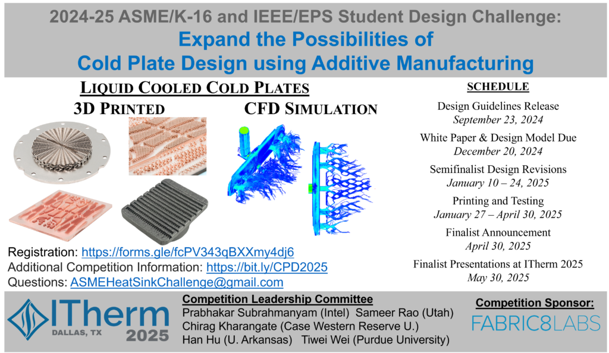

# ASME K-16/IEEE EPS Cold Plate Design Competition
* This repository includes the design guidelines and CAD files of housing for ASME K-16/IEEE EPS Cold Plate Design Competition  
* Update on 10/8/2024: The IP term in the design guidelines document (Page 4) for 2024-2025 comptition has been updated: The participants retain ownership, but the competition organizers and manufacturer (Fabric8Labs) shall be granted a perpetual, non-exclusive right to use the designs for educational, research, or commercial purposes.
* Update on 10/9/2024: The submission requirements are clarified in the design guidelines: The numerical model can use any software, including but not limited to COMSOL, Fluent, Icepak, and AEDT. 
## For 2024-2025 Competition
### Competition Information
* Competition webpage: https://www.ieee-itherm.net/cold-plate-competition-2025/  
* Students competing in this challenge will design a cold plate according to the provided guidelines.
* 2025 Cold Plate Competition Guidelines contains information about the design challenge and design process.
* Make sure to register for the competition at https://forms.gle/fcPV343qBXXmy4dj6 to receive competition updates.
* CAD files for the experimental setup and the heat sink base are stored on GitHub at https://github.com/hanhuark/coldplatedesigncompetition
* A template for your white paper is provided in Word, but you can also use Latex/Overleaf from https://www.ieee.org/conferences/publishing/templates.html, but you should read the word document to understand the required information for this competition.
Questions can be sent to asmeheatsinkchallenge@gmail.com.

  

### 2025 White Paper & Model File Submission Information: 
* Deadline: December 20, 2024 at 11:59 pm Eastern Time
* Please fill out the white paper submission form and upload the following files to Box folder with the naming convention  “team_name.pdf” (for the white paper) and your model/simulation file as “team_name.*”. Note that you should upload your white paper (as a PDF following the provided template) and also upload all three model files listed below:
* A Simulation File: You may provide your computational model in any common simulation format (e.g., COMSOL, ANSYS, etc.). 
STL Format of your Geometry
STEP Format of your Geometry
Note: if your team uses software that only produces *.stl files, you are still responsible for converting those into a valid *.step file before submission.
* As part of this design challenge, you will be asked to design, build, and validate a copper cold plate made with Additive Manufacturing techniques graciously made available to us by Fabric8Labs.
* After reviewing the guidelines, you will need to prepare a white paper that justifies your design due on December 20, 2024. This can be done with preliminary test results, modelling, empirical correlations, etc. The top white papers and designs will be selected to print their part in spring 2025. The semi-finalist teams may need to revise their designs to meet printing requirements during the window of January 10 – 24, 2025.
* Those cold plates will then be sent for testing in order to determine the top designs with finalists notified around the end of April, 2025. These top teams will receive partial travel support to help one member travel to ITherm 2025 (in Dallas, TX from May 27 – 30, 2025) where they will defend their design in front of industry leaders.
